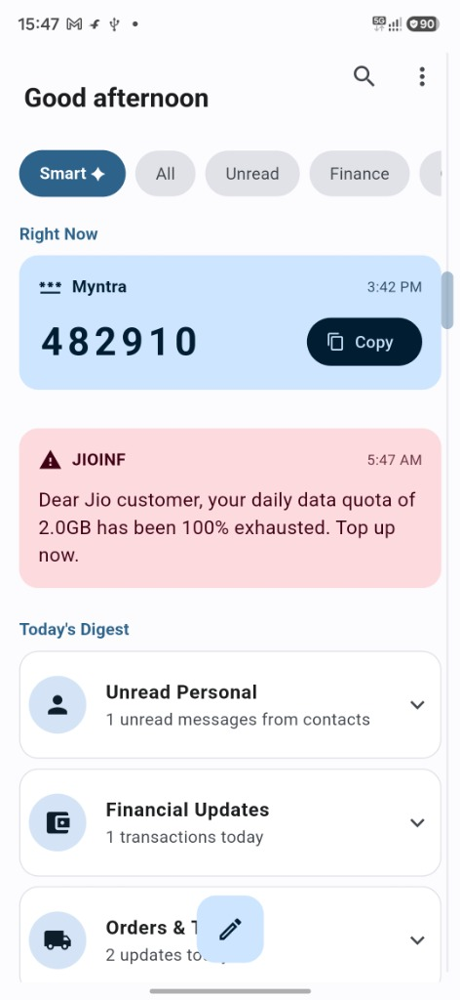
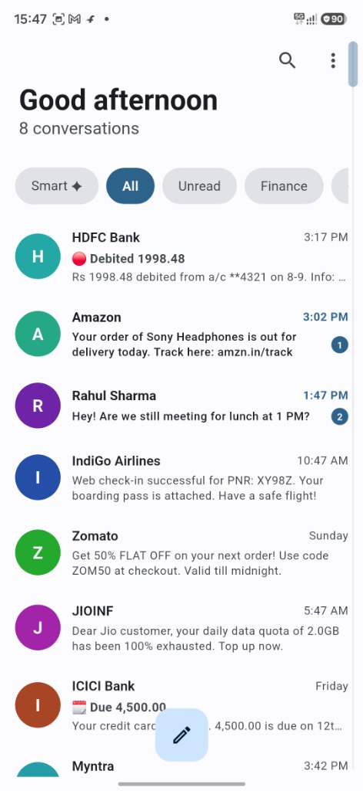
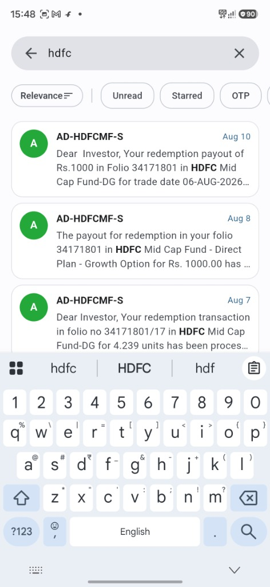

<div align="center">
  
  <h1>Smart SMS Manager</h1>
  <p>A modern, intelligent, and fast SMS messaging app for Android.</p>

  <a href="https://play.google.com/store/apps/details?id=com.dheeru.sms_manager">
      
  </a>
</div>

## 📸 Screenshots

<p align="center">
  
  
  
</p>

## ✨ Features

- **Intelligent Organization:** Automatically categorizes your SMS into Personal, Finance, Orders, and more using on-device Machine Learning.
- **Smart OTP Extractor:** Instantly detects OTPs from incoming messages and provides a one-tap copy button in the "Right Now" section.
- **Today's Digest:** Get a quick, at-a-glance summary of your unread personal messages, financial transactions, and order updates.
- **Powerful Search:** Hybrid AI search and FTS5 let you find any message instantly with advanced filters (Unread, Starred, OTP, etc.).
- **Privacy First:** All categorizations and machine learning processes happen strictly **on-device**. Your messages never leave your phone.
- **Material You Design:** A beautiful, responsive, and modern UI built with Flutter, following the latest Material Design 3 guidelines.
- **Fully Featured SMS Client:** Includes Dual SIM support, mark as read, delete, star messages, delivery reports, native SMS drafts, and a headless SMS service for reliable background syncing.

## 🤝 Feedback & Contributions

We value your feedback! Please feel free to [open an issue](https://github.com/Dheeraj-Reddy-Mallapu/sms_manager/issues) to report bugs, provide suggestions, or request new features. 

If you'd like to contribute to the project, pull requests are always welcome!

## 🚀 Building Locally

1. Clone the repository:
   ```bash
   git clone https://github.com/Dheeraj-Reddy-Mallapu/sms_manager.git
   ```
2. Get Flutter dependencies:
   ```bash
   flutter pub get
   ```
3. Run the app:
   ```bash
   flutter run
   ```
